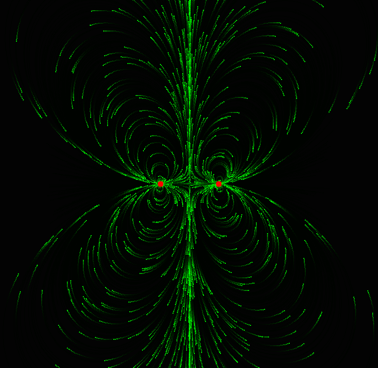

# Magnetic Field Visualizer (Java)

An interactive magnetic field simulator built in Java using Swing.  It's fun

## Features

- Real-time magnetic field visualization
- Particle-based field line simulation
- Click-and-drag magnets (dipoles)
- Dynamic field updates
- Smooth particle trails (ferrofluid-style effect)

## Demo

Move magnets around and watch the field reconfigure in real time.

## How to Run

```bash
javac magnet/*.java
java magnet.Main